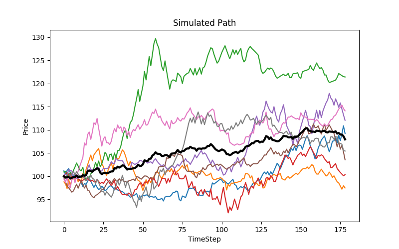

# Black-Scholes-Monte-Carlo-Simulations
## Stock Market Forecasting using CUDA Monte-Carlo Simulations 

### Build
```bash
make
```

### Run
```bash
./stockast
```

Check opt.csv for result.

### Draw Plot
```python
import numpy as np
import matplotlib.pyplot as plt

filename="./opt.csv"
bs_arr = np.loadtxt(open(filename, "rb"), delimiter=",", skiprows=0)
paths = bs_arr[:,0:-1]
avg_path =  bs_arr[:,-1]
plt.figure(figsize=(8,5))
plt.plot(paths)
plt.plot(avg_path, linewidth='3', label="avg", color='k')

plt.title('Simulated Path')
plt.ylabel('Price')
plt.xlabel('TimeStep')
plt.show()
```


